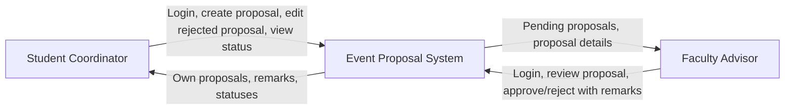
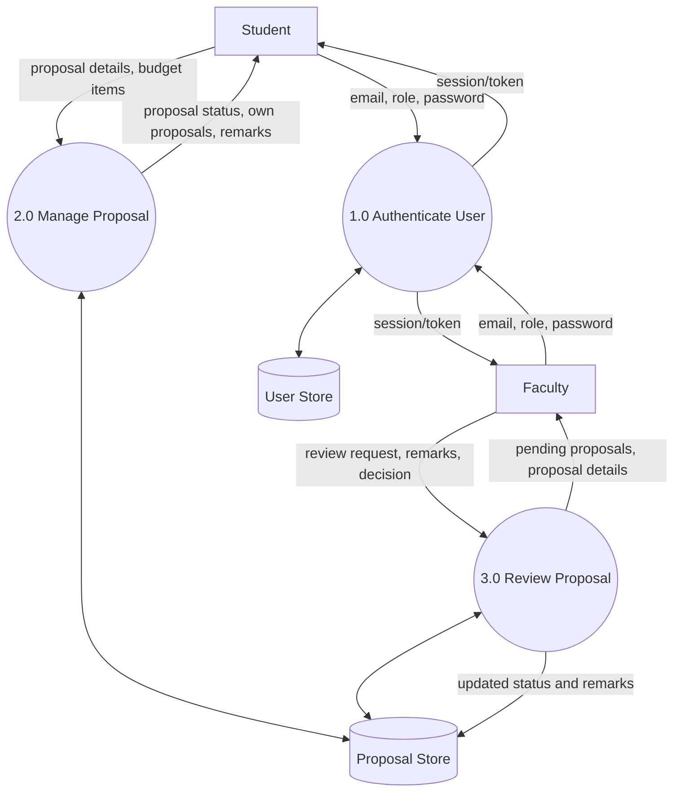
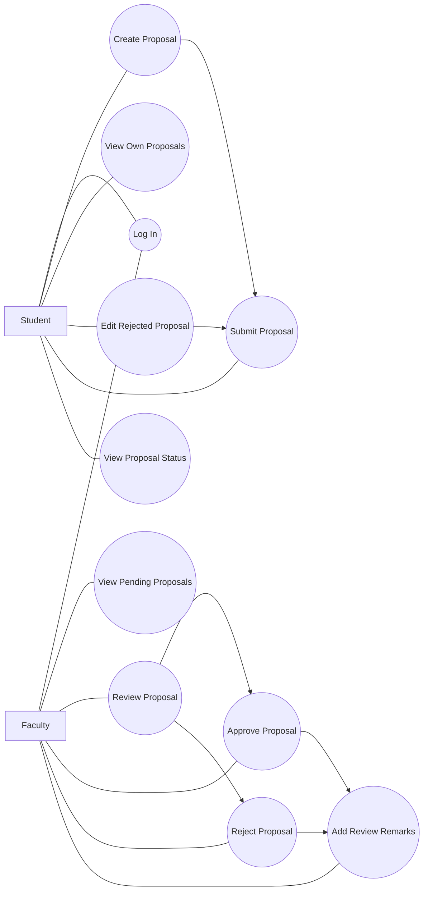
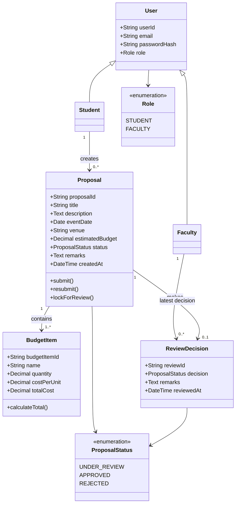
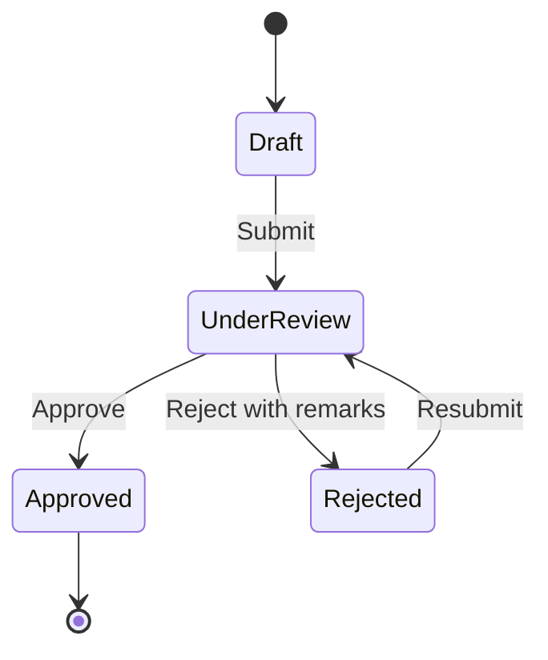

# System Architecture Design - Event Proposal System

## 1. Architecture Overview
Phase 1 uses a simple two-actor workflow with a future-ready client-server design.

Recommended production architecture:

- Frontend: Web UI for student and faculty workflows
- Backend API: REST service handling authentication, authorization, proposals, and reviews
- Database: Relational database for users, proposals, budget items, and review remarks

Logical flow:

1. User authenticates through the web client.
2. Frontend calls backend APIs.
3. Backend validates role permissions and business rules.
4. Backend stores and retrieves proposal data from the database.

## 2. Context-Level DFD



## 3. Final DFD - Level 1



## 4. Use Case Diagram



## 5. Class Diagram



## 6. State Model



## 7. Future Backend API Requirements

### 7.1 Authentication

| Method | Endpoint | Purpose |
|---|---|---|
| `POST` | `/api/auth/login` | Authenticate user and return session/token |
| `POST` | `/api/auth/logout` | Invalidate active session |
| `GET` | `/api/auth/me` | Get current authenticated user |

Request for login:

```json
{
  "email": "student@university.edu",
  "password": "string",
  "role": "student"
}
```

### 7.2 Student Proposal APIs

| Method | Endpoint | Purpose |
|---|---|---|
| `GET` | `/api/proposals/mine` | Get proposals of logged-in student |
| `POST` | `/api/proposals` | Create proposal |
| `GET` | `/api/proposals/{proposalId}` | Get proposal details |
| `PUT` | `/api/proposals/{proposalId}` | Update rejected proposal |

### 7.3 Faculty Review APIs

| Method | Endpoint | Purpose |
|---|---|---|
| `GET` | `/api/reviews/pending` | Get all proposals under review |
| `POST` | `/api/reviews/{proposalId}/approve` | Approve proposal |
| `POST` | `/api/reviews/{proposalId}/reject` | Reject proposal with remarks |

### 7.4 Core Proposal Payload

```json
{
  "title": "Annual Tech Symposium",
  "description": "Technical event for students and guests",
  "eventDate": "2026-08-20",
  "venue": "Main Auditorium A",
  "budgetItems": [
    {
      "name": "Stage Setup",
      "quantity": 1,
      "costPerUnit": 15000
    },
    {
      "name": "Refreshments",
      "quantity": 250,
      "costPerUnit": 120
    }
  ]
}
```

### 7.5 Review Payloads

Approve:

```json
{
  "remarks": "Approved. Coordinate final venue booking with administration."
}
```

Reject:

```json
{
  "remarks": "Budget breakdown is incomplete and venue capacity is not justified."
}
```

### 7.6 Backend Validation Rules
- Only authenticated students can create proposals.
- Only the owner student can read or update their own rejected proposal.
- Only faculty can access pending reviews and decision endpoints.
- Updates are allowed only when proposal status is `Rejected`.
- Rejection remarks are mandatory.
- At least one budget item must be present.
- `estimatedBudget` must be computed on the server, not trusted from the client.

## 8. Recommended Database Entities

| Entity | Purpose |
|---|---|
| `users` | Stores login identity and role |
| `proposals` | Stores proposal header data and current status |
| `budget_items` | Stores line items per proposal |
| `review_decisions` | Stores faculty review action and remarks |

## 9. Deployment Direction
Recommended stack for the next phase:

- Frontend: HTML/CSS/JavaScript or React
- Backend: Node.js/Express, Java/Spring Boot, or Python/FastAPI
- Database: MySQL or PostgreSQL
- Auth: Session-based auth or JWT with role claims

## 10. Traceability to Prototype
The current frontend prototype already validates the Phase 1 business flow:

- `Student` creates and views proposals
- `Faculty` reviews only `Under Review` proposals
- `Rejected` proposals become editable again
- `Approved` and `Under Review` proposals remain read-only to students
- Budget totals are calculated from line items
